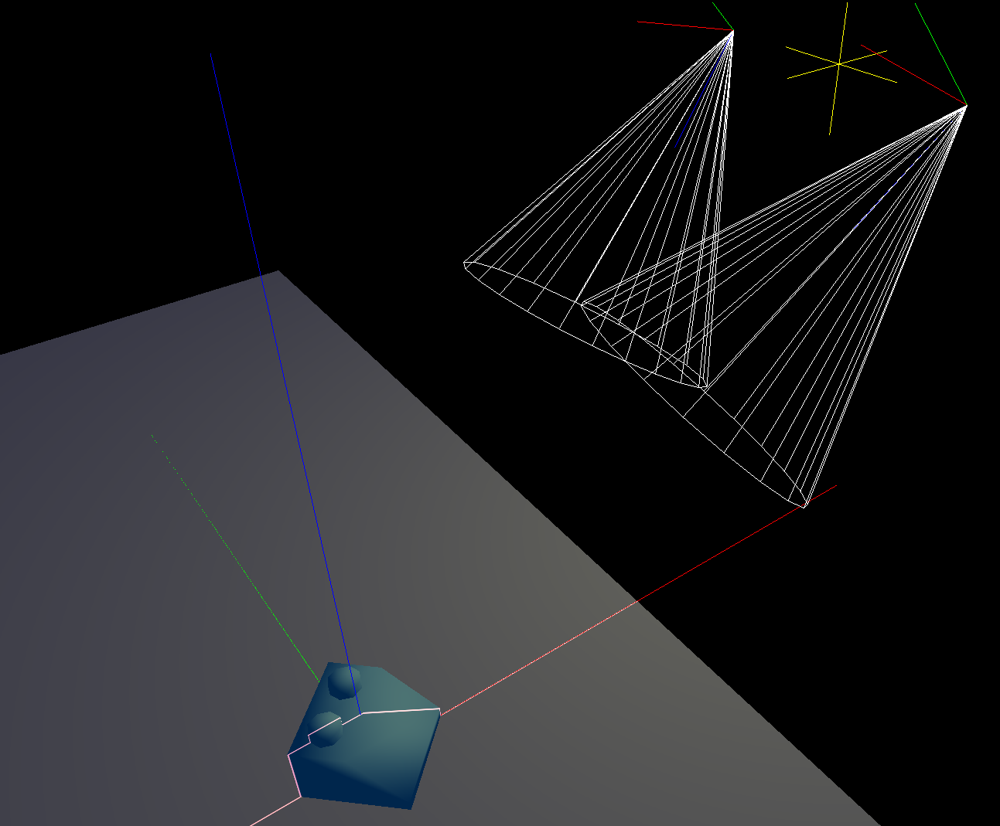
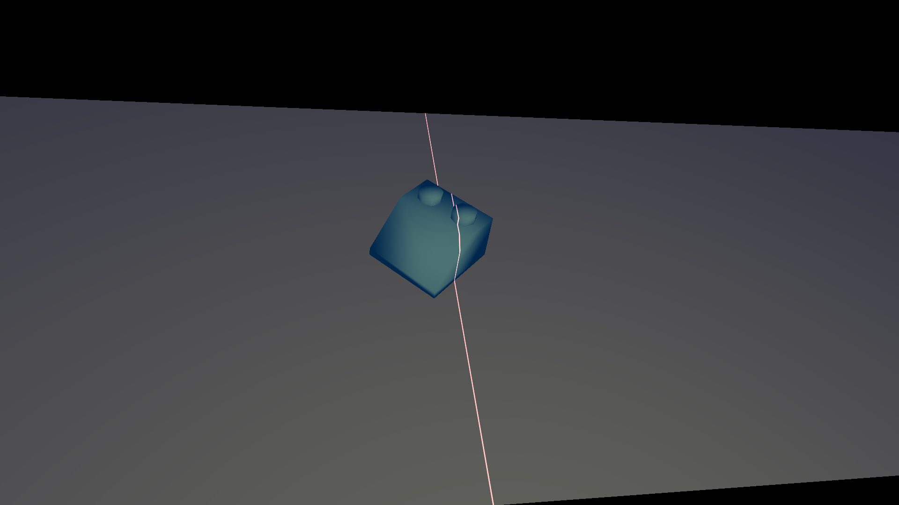
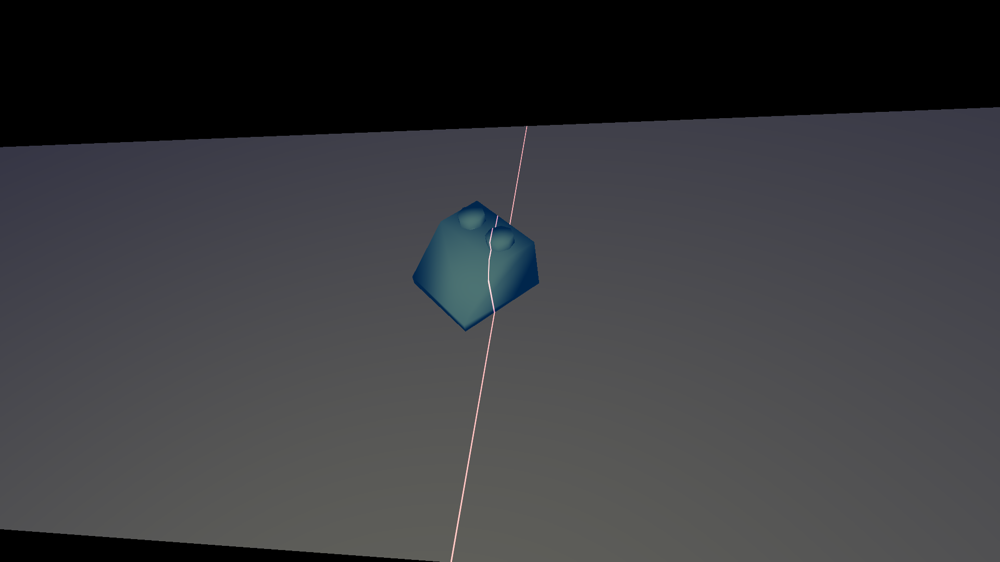
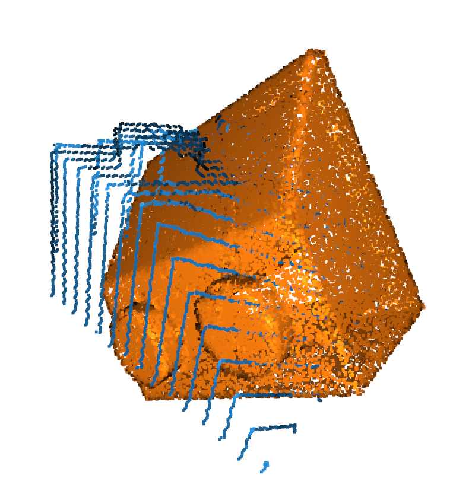
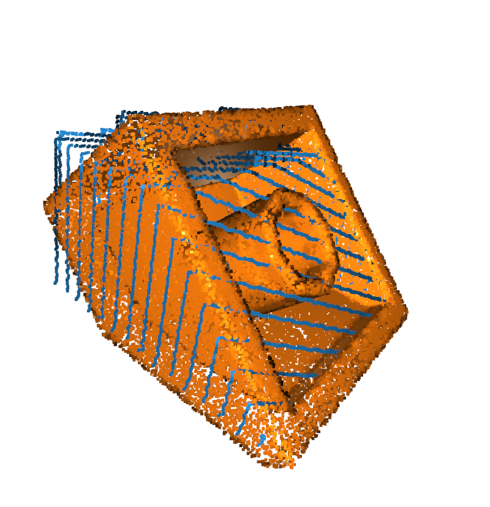
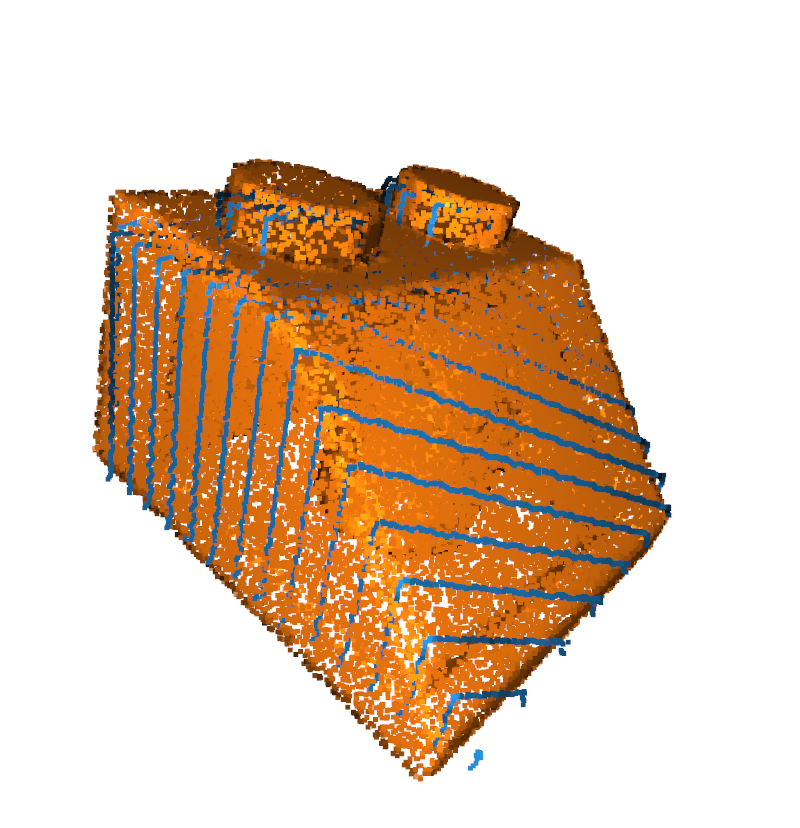
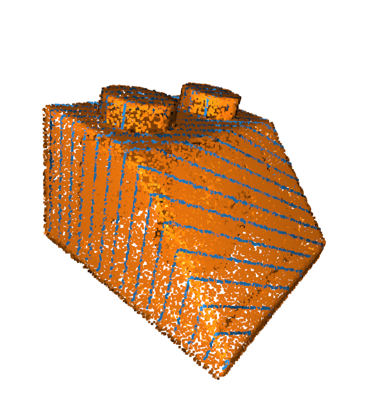

[![MIT License][license-shield]][license-url]
[![LinkedIn][linkedin-shield]][linkedin-url]


<!-- TABLE OF CONTENTS -->
<details>
  <summary>Table of Contents</summary>
  <ol>
    <li>
      <a href="#about-the-project">About The Project</a>
      <ul>
        <li><a href="#built-with">Built With</a></li>
      </ul>
    </li>
    <li>
      <a href="#getting-started">Getting Started</a>
      <ul>
        <li><a href="#prerequisites">Prerequisites</a></li>
        <li><a href="#installation">Installation</a></li>
      </ul>
    </li>
   <li>
      <a href="#pipeline">Brick Identification Pipeline</a>
      <ul>
        <li><a href="#image-generation">Simulation-based Image Generation</a></li>
        <li><a href="#reconstruction">3D Reconstruction</a></li>
        <li><a href="#alignment">Point Cloud Alignment and Rating</a></li>
      </ul>
   </li>
    <li><a href="#real-reconstruction">3D Reconstruction from real Image Pairs</a></li>
    <li><a href="#color-detection">Color Detection</a></li>
    <li><a href="#license">License</a></li>
  </ol>
</details>


<!-- ABOUT THE PROJECT -->
## About The Project

This project contains the source code used in my master thesis written at the Technical 
University of Darmstadt in 2022. 

**Title:** 
Automatic detection and sorting by using optical
methods and enhanced computer vision
algorithms on the example of LEGO® Bricks - Part: Scanning, 3D-Reconstruction & Model
Matching

**Abstract:**
In cooperation, the Institute of Materials Science (If W) and the Department of Graphical Interactive Systems
(GRIS) initiated the project to implement a modern LEGO ® sorting machine. Due to the scope of this project,
the realization of the machine was divided into three works.

In this work, a novel 3D reconstruction pipeline is introduced, combining two stereo camera setups with
line lasers, for geometry and color independent shape retrieval. This setup allows reconstructing objects
on continuous conveyor belt systems in real time. In addition, an OpenGL simulator is presented, which
provides virtual image rendering for the introduced setup and builds the transition between OpenGL and
OpenCV conventions. With that, the reconstruction pipeline, implemented and tested in simulation, is directly
applicable to the real setup.

Furthermore, a classification for reconstructed point clouds is performed to categorize each reconstructed
brick to one of the models from a database with approximately 5,000 models. Therefore, a bounding box
similarity search, based on Principal Component Analysis (PCA), is performed, which reduces the amount of
models for point cloud registration and alignment quality measure.

### Built With

[![Bootstrap][Python.badge]][Python-url]
[![Bootstrap][OpenGL.badge]][OpenGL-url]
[![Bootstrap][OpenCV.badge]][OpenCV-url]

<p align="right">(<a href="#readme-top">back to top</a>)</p>

<!-- GETTING STARTED -->
## Getting Started

### Prerequisites

This project uses the detailed brick models, provided by the [LDraw](https://www.ldraw.org/) community. 
In order to use this library the following steps are required.

1. Download and unpack the complete [LDraw Parts Library](https://www.ldraw.org/library/updates/complete.zip)

2. Install [LDView](https://tcobbs.github.io/ldview/), a real-time 3D viewer for displaying LDraw models. 
Its command line backend allows converting the LDraw models to the STL file format.
After installation, check if the application is executable from command line via
   ```sh
   LDView
   ```

### Installation
1. Clone the repo
   ```sh
   git clone https://github.com/flowmeadow/BrickScanner.git
   ```
2. Install the required pip packages
   ```sh
   pip install -r requirements.txt
   ```

3. Open the file `definitions.py` and update the paths `IMG_DIR`, `DATA_DIR`, `BRICK_DIR` and `STL_DIR`
   * Set `BRICK_DIR` to the current location of the 'parts' folder, which is inside the 
   extracted LDraw parts library
   * Create and reference empty folders for `IMG_DIR`, `DATA_DIR` and `STL_DIR`
   ```python
   # paths
   ROOT_DIR = os.path.dirname(os.path.abspath(__file__))
   IMG_DIR = os.path.join(ROOT_DIR, '_images')
   DATA_DIR = os.path.join(ROOT_DIR, '_data')
   BRICK_DIR = '/home/user/ldraw/parts'
   STL_DIR = os.path.join(ROOT_DIR, '_stl')
   ```

4. Convert models to the STL format with
   ```sh
   python scripts/create_stl_files.py
   ```
   This will start the conversion of each brick. Each model from `BRICK_DIR` is opened with the LDView application, 
converted to the STL format and stored in `STL_DIR`. This progress can take some time and requires approximately 2GB
of memory.

<p align="right">(<a href="#readme-top">back to top</a>)</p>


<!-- USAGE EXAMPLES -->
# Brick Identification Pipeline

In this section, the simulation-based brick identification pipeline is introduced. 
An example for all the following steps is given in [demo.py](demo.py).

### Simulation-based Image Generation
To evaluate the proposed pipeline, an OpenGL simulator is used to render stereo image pairs while 
a virtual brick is forwarded through the laser blade, realized with a shader.

**Screenshot of the OpenGL simulator**



**Rendered images from the left and right camera view**

<p float="left">


</p>

### 3D Reconstruction
To obtain a 3D point cloud of the model, first, the section in the image pairs containing the laser light projection
is isolated. Afterwards, using the epipolar constraints of the stereo camera views, corresponding 2D points from each 
two images are determined. These point pairs are used to compute the respective 3D points.

**Simulation-based reconstructed point clouds for exemplary bricks**

<p float="left">


</p>

### Point Cloud Alignment and Rating
Using Principal Component Analysis (PCA) and the Iterative Closest Point (ICP) algorithm, the most similar brick models
from the LDraw database are selected and the optimal alignment is determined. Using the final alignment error of these 
bricks gives an estimate for the brick ID.

**Demonstration of the different alignment steps**

<p float="left">




</p>

## 3D Reconstruction from real Image Pairs

WIP

<p align="right">(<a href="#readme-top">back to top</a>)</p>


## Color Detection

WIP

<p align="right">(<a href="#readme-top">back to top</a>)</p>


<!-- LICENSE -->
## License

Distributed under the MIT License. See `LICENSE.rst` for more information.

<p align="right">(<a href="#readme-top">back to top</a>)</p>


<!-- MARKDOWN LINKS & IMAGES -->
[license-shield]: https://img.shields.io/badge/License-MIT-<COLOR>?style=for-the-badge
[license-url]: https://github.com/flowmeadow/pygletPlayground/blob/e45b61bddf8b22932f94ca77957ece683284a3dd/LICENSE.rst
[linkedin-shield]: https://img.shields.io/badge/-LinkedIn-black.svg?style=for-the-badge&logo=linkedin&colorB=555
[linkedin-url]: https://www.linkedin.com/in/florian-wiese-155527a4/
[Python.badge]: https://img.shields.io/static/v1?message=Python&logo=python&color=1182c3&logoColor=white&label=%20&style=for-the-badge
[Python-url]: https://www.python.org/
[OpenGL.badge]: https://img.shields.io/static/v1?message=OpenGL&logo=opengl&color=1182c3&logoColor=white&label=%20&style=for-the-badge
[OpenGL-url]: https://www.opengl.org/
[OpenCV.badge]: https://img.shields.io/static/v1?message=OpenCV&logo=opencv&color=1182c3&logoColor=white&label=%20&style=for-the-badge
[OpenCV-url]: https://opencv.org/